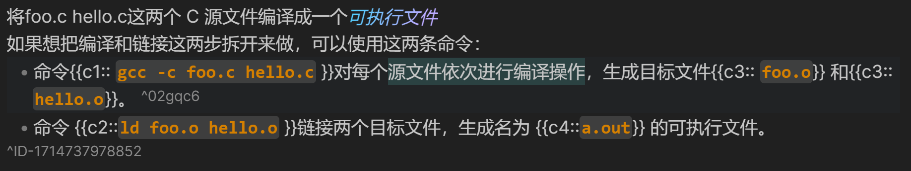

# 简介
本项目由 [Obsidian_to_Anki](https://github.com/Pseudonium/Obsidian_to_Anki) fork而来
在原来代码的基础上，添加一些功能
1. 让obsidian markdown文件中的卡片在anki的deck的结构与文件夹结构保存一致
例如："/root/hello/world.md"中的卡片会自动同步到"root::hello::world"中
2. 把id修改为blockid的形式，从而实现anki直接跳转到obsidian markdown文件对应的block
  
3. 优化了context的内容，路径和标题加在最前面，以换行分割，后面有一行分割线和卡片具体内容区分。标题中如果有链接或公式可以转化成功。
4. 对于卡片中对blockid的引用链接，自动转化为anki link插件支持的格式`[link test|nid1714433449297]`
5. 优化了$的识别。现在\\\$不会识别为公式，会转化为\$。修改的格式化的顺序。现在先处理代码的部分。所以代码中出现\$不会识别为latex
# 本项目使用方法
将main.js和manifes.json文件替换obsidian to anki中的main.js manifes.json
在插件设置中，开启设置，并重启obsidian
具体的使用方法可以参考[Obsidian_to_Anki](https://github.com/Pseudonium/Obsidian_to_Anki)

原来的正则表达式`(?<!<!--)`改为`(?<!<!--)(?<!\^ID-)`即可正常使用blockid
 
# todo
优化数学公式的转化,保证`}}`能够正常显示
修复bug，行末链接会导致卡片无法导入
修复bug，markdown文件过长会导致卡片无法正常导入
优化hash算法或者加入当前文件必定扫描，如果文件过长，修改了文件靠后的内容，不会识别到文件修改，除非后半部分改动很大
优化有时候一些卡片无法识别到bug 跳过的范围存在问题
添加代码形式的卡片
```anki
font
---
back
```
# \$失效的场景
`M` : Block math mode. Only run this snippet inside a `$$ ... $$` block  
    `M` ：块数学模式。仅在 `$$ ... $$` 块内运行此代码段
- `n` : Inline math mode. Only run this snippet inside a `$ ... $` block  
    `n` ：内联数学模式。仅在 `$ ... $` 块内运行此代码段


识别blockid失败

# tip
填空题存在问题，可能会匹配bookxnote和latex公式,请使用"((?:.+\n)*(?:.*{{c.*)(?:\n(?:^.{1,3}$|^.{4}(?<!<!--).*))*)",
并只使用{{c\d:: text }}格式的填空题
推荐搭配latex-suite快速输入
# Introduction
This project was forked by [Obsidian_to_Anki](https://github.com/Pseudonium/Obsidian_to_Anki) Based on the original code, two features have been added 
1. Let the cards in the Obsidian markdown file be synchronized with the folder structure in the anki. For example, cards in "/root/hello/world.md" will be automatically synchronized to "root::hello::world". 

2.Change the id to a block link so that anki jumps directly to the corresponding block in the obsidian markdown file.
  

# How to use
Replace the main.js and manifes.json file with the main.js and manifes.json in Obsidian to Anki
In the plugin settings, turn on the settings and restart obsidian
For details, please refer to [Obsidian_to_Anki](https://github.com/Pseudonium/Obsidian_to_Anki).