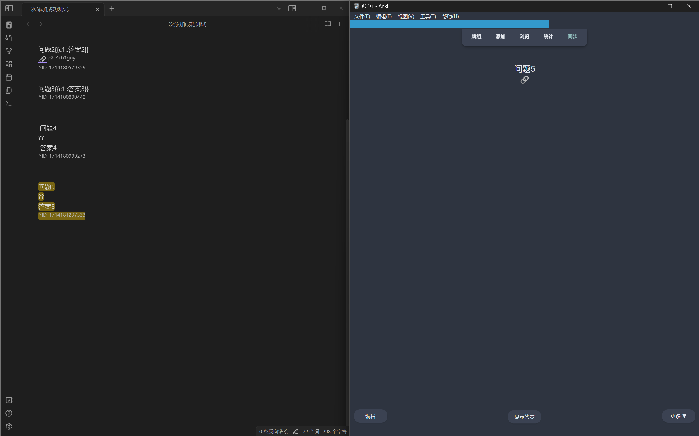

# norcx' Obsidian_to_Anki

[中文文档](README.zh-CN.md)

This project is forked from [Obsidian_to_Anki](https://github.com/Pseudonium/Obsidian_to_Anki). It keeps the upstream plugin's core workflow for syncing flashcards from Obsidian Markdown files to Anki, and adds several changes for folder-based deck organization, block-level source links, richer context output, and safer math/code formatting.

The original plugin documentation is still relevant for the basic note syntax, AnkiConnect setup, custom regular expressions, image/audio syncing, frozen fields, deletion markers, and general scan workflow. This README focuses on the behavior added or changed in this fork.

## Feature Overview

### 1. Sync Cards To Decks Based On Obsidian Paths

When `Use Path as Deck` is enabled, the plugin converts the Markdown file path into an Anki deck path.

Example:

```text
Obsidian file: root/hello/world.md
Anki deck:    root::hello::world
```

This is useful when your Obsidian vault already has a meaningful folder structure, such as courses, chapters, projects, or subjects, and you want Anki decks to follow the same hierarchy.

When this option is enabled, the file path takes priority over the file-level `TARGET DECK` setting. Disable `Use Path as Deck` if you want individual Markdown files to control their target deck with `TARGET DECK`.

### 2. Use Obsidian Block IDs As Card IDs

The upstream plugin writes card IDs like this:

```text
ID: 1714433449297
```

This fork can write the ID as an Obsidian block ID:

```text
^ID-1714433449297
```

Because Obsidian treats `^ID-...` as a block anchor, a source link in Anki can open the original Markdown file at the exact block that generated the card, instead of only opening the file.



### 3. Jump From Anki Back To The Obsidian Block

When both `Add File Link` and `Add Card link` are enabled, the plugin appends an Obsidian source link to the configured field. The link points to the block ID for that card.

The generated link is conceptually like this:

```html
<a href="obsidian://open?...#^ID-1714433449297" class="obsidian-link">link</a>
```

This depends on two things:

1. The Markdown card has, or will receive, a `^ID-...` block ID.
2. Obsidian can open `obsidian://open` links on your machine.

For newly added notes, the final Anki note ID is only known after AnkiConnect creates the note. The plugin therefore adds the note first, receives the note ID, writes the block ID back to Markdown, and then performs a second field update so the source link points to the real block.

### 4. Improved Context Output

When `Add Context` is enabled, the plugin writes the card's file and heading context into the configured context field. This fork changes the context output in several ways:

1. Context is prepended before the card content instead of appended after it.
2. The file path and heading hierarchy are separated with line breaks.
3. A horizontal rule is inserted between the context and the card content.
4. Markdown links inside headings are converted to HTML links.
5. `$...$` math inside headings is converted to Anki-compatible inline math.

The output is roughly:

```html
<br>course/chapter-5.md<br>Integrated Counters<br>Synchronous Counters<br><hr>
```

This makes review cards easier to place back into their original notes, especially for long course notes or chapter-based documents.

### 5. Safer Math And Code Formatting

This fork changes the Markdown-to-Anki formatting order:

1. Protect fenced code blocks and inline code first.
2. Convert Obsidian math syntax.
3. Process cloze syntax, highlights, media, and links.
4. Restore the protected code content.
5. Convert the remaining Markdown to HTML.

This prevents `$` inside code from being parsed as LaTeX. Escaped dollar signs such as `\$` are not treated as math delimiters and are restored to `$` in the final output.

### 6. Link Behavior

Regular Obsidian links in note content are still converted to `obsidian://open` HTML links.

Markdown links that point to Obsidian blocks are handled the same way: they remain Obsidian links after formatting.

## Installation And Usage

### Requirements

1. Obsidian is installed.
2. Anki is installed.
3. AnkiConnect is installed and enabled in Anki.
4. AnkiConnect allows requests from Obsidian. A typical configuration includes `app://obsidian.md`.

For the full upstream setup instructions, see:
[Obsidian_to_Anki](https://github.com/Pseudonium/Obsidian_to_Anki)

### Build And Install Manually

Install dependencies:

```bash
npm install
```

Build the plugin:

```bash
npm run build
```

Copy these files into the Obsidian plugin folder, replacing the corresponding files from the original plugin:

```text
main.js
manifest.json
styles.css
```

Then restart Obsidian and enable the plugin.

### Recommended Settings

| Setting | Recommendation | Purpose |
| --- | --- | --- |
| `Add File Link` | Enable | Adds a link from Anki back to Obsidian. |
| `Add Card link` | Enable | Makes the source link target the exact Obsidian block. |
| `Use Path as Deck` | Enable if desired | Maps Markdown file paths to Anki deck paths. |
| `Add Context` | Enable | Adds file and heading context before the card content. |
| `ID Comments` | Usually disable for block IDs | HTML comments hide IDs from Obsidian block recognition. |

## Custom Regex Compatibility

If your custom regular expression previously used this guard to avoid matching ID lines:

```regex
(?<!<!--)
```

Change it to:

```regex
(?<!<!--)(?<!\^ID-)
```

The block ID line now looks like this:

```text
^ID-1714433449297
```

Without excluding `^ID-`, a custom regex may accidentally include the ID line as part of the next card body.

## Cloze Notes

For cloze notes, prefer Anki's native cloze syntax:

```text
{{c1::text to hide}}
```

This avoids accidental matches with BookxNote links, LaTeX fragments, or other Markdown content.

One custom regex pattern that can work with block IDs is:

```regex
((?:.+\n)*(?:.*{{c.*)(?:\n(?:^.{1,3}$|^.{4}(?<!<!--)(?<!\^ID-).*))*)
```

## Development

Run the TypeScript/Rollup build:

```bash
npm run build
```

Run the upstream test suite:

```bash
npm test
```

The full test suite depends on the upstream Docker/Webdriver setup and a working Anki test environment.

## Notes

The project still follows the upstream plugin architecture. The main changes are concentrated in:

```text
src/file.ts
src/files-manager.ts
src/format.ts
src/note.ts
src/settings.ts
src/setting-to-data.ts
src/interfaces/settings-interface.ts
```

Known edge cases and cleanup tasks are intentionally left for separate issues or pull requests.
