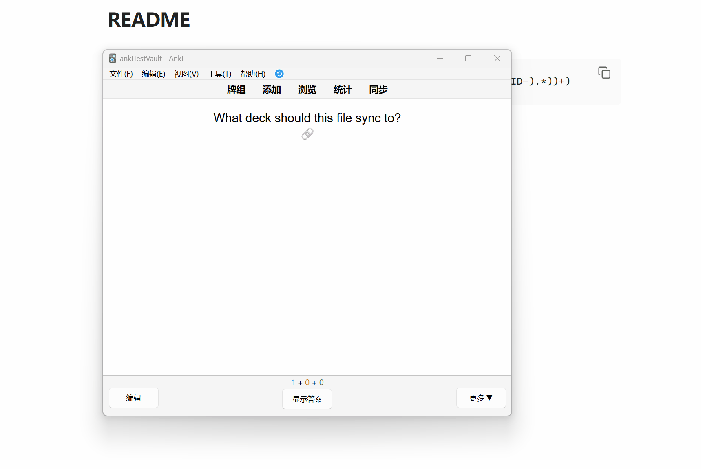

# better-obsidian-to-anki

[English documentation](README.md)

better-obsidian-to-anki fork 自 [Obsidian_to_Anki](https://github.com/Pseudonium/Obsidian_to_Anki)。原项目已经很久没有活跃维护，所以这个 fork 保留原来的 Obsidian 到 Anki 同步流程，并加入一些我自己学习时希望有的功能。

最主要的新增功能是来源跳转：Anki 里的卡片可以跳回生成它的 Obsidian block。这个 fork 也支持按 Obsidian 文件路径组织 Anki 牌组，例如 `LinearAlgebra/matrix-derivatives.md` 可以同步到 `LinearAlgebra::matrix-derivatives`。



## 改动概览

- Anki 卡片可以通过 `obsidian://open` 链接跳回具体 Obsidian block。
- 卡片 ID 可以写成 Obsidian block id，例如 `^ID-1714433449297`。
- `Deck` 可以使用 `{path}` 等模板，让 Anki 牌组跟随 Obsidian 文件路径。
- 设置了 `Scan Directory` 时，生成路径牌组会移除扫描目录前缀。
- 移动或重命名 Markdown 文件后，可以把已有 Anki 卡片移动到新的路径牌组。
- context 可以放在字段开头，显示文件路径和标题层级。
- 数学公式和代码块的格式化顺序更安全，代码里的 `$` 不会被误识别为 LaTeX。

原插件文档仍然适用于基础笔记语法、AnkiConnect 配置、自定义正则、媒体同步、Frozen Fields 和删除标记。

## Deck 模板

`Deck` 设置可以是固定牌组名，也可以是模板。支持的变量：

```text
{path}    去掉 .md 后的 Obsidian 文件路径，用 :: 分隔
{folder}  父目录路径，用 :: 分隔
{file}    去掉 .md 后的文件名
```

示例：

```text
Deck:      Default
Anki deck: Default
```

```text
Deck:          {path}
Obsidian file: root/hello/world.md
Anki deck:     root::hello::world
```

```text
Deck:          {folder}::{file}
Obsidian file: LinearAlgebra/matrix-derivatives.md
Anki deck:     LinearAlgebra::matrix-derivatives
```

如果设置了 `Scan Directory`，会移除这个前缀：

```text
Scan Directory: anki
Deck:           {path}
Obsidian file:  anki/LinearAlgebra/matrix-derivatives.md
Anki deck:      LinearAlgebra::matrix-derivatives
```

新生成配置中，`Deck` 默认为 `{path}`。旧的路径牌组配置会自动迁移为 `Deck = {path}`。移动或重命名 Markdown 文件后，下次扫描会把已有 Anki 卡片移动到新的路径牌组。

## Block 跳转

原插件写入的 note ID 类似：

```text
ID: 1714433449297
```

这个 fork 可以写成 Obsidian block id：

```text
^ID-1714433449297
```

开启 `Add File Link` 和 `Add Card link` 后，插件会在指定 Anki 字段里追加来源链接。这个链接指向具体 block：

```html
<a href="obsidian://open?...#^ID-1714433449297" class="obsidian-link">link</a>
```

新增卡片时，插件会先创建 Anki note，拿到 note ID，把 block ID 写回 Markdown，然后再次更新 Anki 字段，让链接指向真实 block。

## Context 和格式化

开启 `Add Context` 后，文件和标题上下文会放在卡片内容前面，并用换行和分割线组织：

```html
<br>course/chapter-5.md<br>Integrated Counters<br>Synchronous Counters<br><hr>
```

Markdown 格式化时会先保护代码块，再处理数学公式、cloze、高亮、媒体和链接。转义美元符号 `\$` 会在最终输出中还原为 `$`。

## 安装

需要：

- Obsidian
- Anki
- AnkiConnect
- AnkiConnect 允许 Obsidian 调用，通常需要包含 `app://obsidian.md`

### 使用 Release Zip 安装

1. 从 [Releases](https://github.com/norcx/new_obsidian_to_anki/releases) 页面下载 `better-obsidian-to-anki-<version>.zip`。
2. 解压到你的 Obsidian vault 插件目录。
3. 最终目录结构应类似：

```text
<vault>/.obsidian/plugins/better-obsidian-to-anki/
  main.js
  manifest.json
  styles.css
```

Windows 上通常类似：

```text
D:\YourVault\.obsidian\plugins\better-obsidian-to-anki
```

重启 Obsidian，然后在第三方插件里启用 `better obsidian to anki`。

### 使用源码安装

克隆本仓库并构建：

```bash
git clone https://github.com/norcx/new_obsidian_to_anki.git
cd new_obsidian_to_anki
npm install
npm run build
```

在你的 vault 中创建插件目录，然后复制这些文件进去：

```text
main.js
manifest.json
styles.css
```

例如：

```text
<vault>/.obsidian/plugins/better-obsidian-to-anki/
  main.js
  manifest.json
  styles.css
```

## 从 Obsidian_to_Anki 迁移

如果你已经用过上游 `Obsidian_to_Anki` 插件，或者用过这个 fork 的旧版本，请保留原来的 `data.json`。这个文件保存插件设置、笔记类型字段映射、已同步媒体缓存和文件 hash。Markdown 文件里已经写入的 Anki note ID 也要保留，不要在迁移时删除或重写。

推荐迁移步骤：

1. 关闭 Obsidian。
2. 找到旧插件目录。上游插件通常类似 `<vault>/.obsidian/plugins/obsidian-to-anki-plugin/`，旧版 fork 可能类似 `norcx-ob-to-anki/`。
3. 创建或重命名目标目录为 `<vault>/.obsidian/plugins/better-obsidian-to-anki/`。
4. 把旧目录里的 `data.json` 保留或复制到目标目录。
5. 用本 fork 的 release zip 或源码构建产物替换 `main.js`、`manifest.json`、`styles.css`。
6. 禁用或移除旧插件目录，避免两个 Obsidian-to-Anki 插件同时扫描同一个 vault。
7. 重启 Obsidian，并启用 `better obsidian to anki`。
8. 升级后打开一次插件设置页。旧的路径牌组配置会在那里迁移为 `Deck = {path}`。

文件处理摘要：

| 文件 | 处理方式 | 原因 |
| --- | --- | --- |
| `data.json` | 从旧插件目录保留或复制 | 保留设置、文件 hash、媒体缓存和字段映射。 |
| `main.js` | 替换为新文件 | 包含这个 fork 的插件代码。 |
| `manifest.json` | 替换为新文件 | 更新插件名称、版本和元数据。 |
| `styles.css` | 替换为新文件 | 保持设置界面样式同步。 |
| Markdown 笔记 | 不要改动 | 已有 note ID 用来连接 Obsidian 卡片和 Anki note。 |

如果你从原始上游插件迁移，Obsidian 可能会把这个 fork 当成另一个插件，因为 manifest ID 可能不同。把旧的 `data.json` 复制到新插件目录，才会把旧设置带到这个 fork。

## 推荐设置

| 设置项 | 建议 | 作用 |
| --- | --- | --- |
| `Add File Link` | 开启 | 在 Anki 字段里加入回到 Obsidian 的链接。 |
| `Add Card link` | 开启 | 让来源链接定位到具体 Obsidian block。 |
| `Deck` | 默认 `{path}` | 固定牌组名，或使用 `{path}`、`{folder}`、`{file}` 的模板。 |
| `Add Context` | 按需开启 | 在卡片内容前加入文件和标题上下文。 |
| `ID Comments` | 使用 block id 时通常关闭 | HTML 注释可能影响 Obsidian 识别 block id。 |

## 自定义正则兼容

如果你的自定义正则以前用这个条件避免匹配 ID 行：

```regex
(?<!<!--)
```

使用 block id 后建议改成：

```regex
(?<!<!--)(?<!\^ID-)
```

否则 `^ID-...` 行可能被误当作卡片正文。

## 开发

```bash
npm run build
npm test
```

完整测试依赖上游 Docker/Webdriver 配置和可用的 Anki 测试环境。
